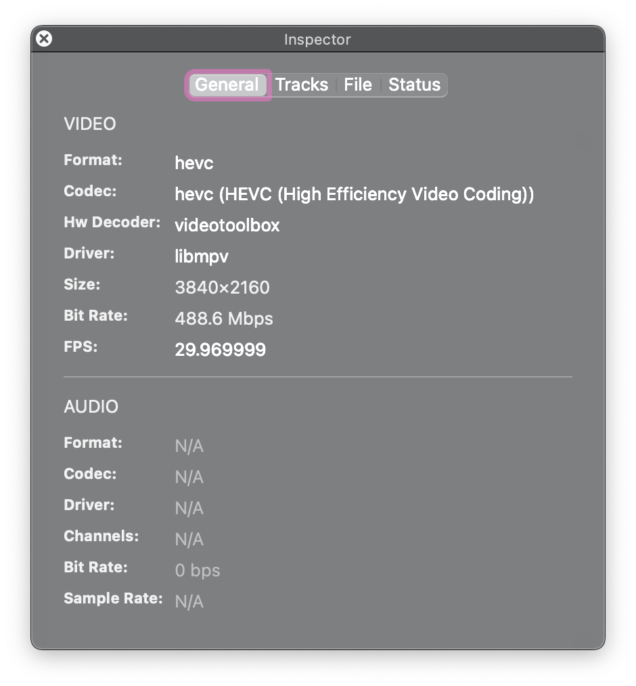
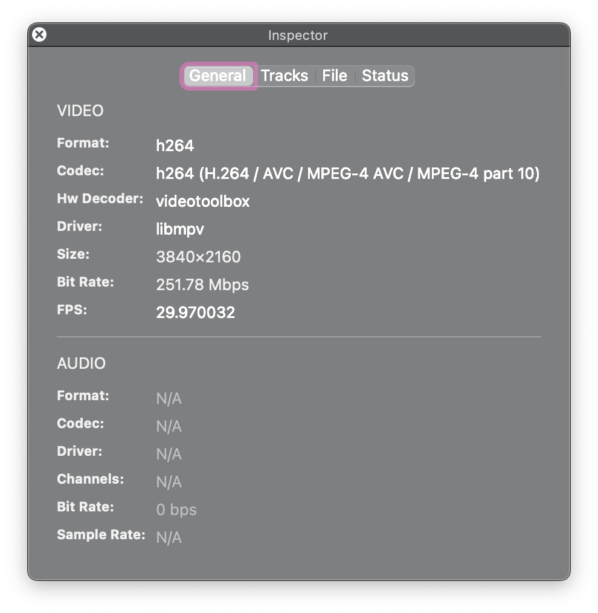

# LG-gram-14z990

Hackintosh macOS on LG Gram14 Z990

This Clover EFI is modified from [capricornlee](https://github.com/capricornlee/LG-Gram13-Z990) 

This OpenCore EFI is modified from [YJack007](http://bbs.pcbeta.com/viewthread-1876088-1-1.html) 

**Notice**：All following information is about OpenCore, and Clover will not be supported by me anymore.

## Configuration

|      | Detail   |
| ---- | -----------------------------------------|
| Model | LG Gram14 Z990|
| CPU  | Core i5-8265U|
| GPU | Intel UHD Graphics 620（Whiskey Lake）|
| Memory | 8G(Build-in)+8G|
| Driver | Have been changed to SN550 1TB|
| Sound Card | Conexant CX8200|
| Network Card | BCM94360CS2(Use a m.2 port)|
| Bluetooth | Intel AC-9560|

## What is working
- [x] Sound(Speaker，3.5mm headphone plug)
- [x] Display(HEVC+H.264 4K hardware decoding; HDMI can output up to 2K@60)
- [x] Wi-Fi(Broadcom Network Card)/Intel Bluetooth(Airdrop;Handoff)
- [x] Power(Battery Percentage; Power Management）
- [ ] Keyboard(Fn Key doesn't work still, except F4, F8, F10, F11, and F12）
- [x] Touchpad
- [x] USB Mapping
- [x] iServices
- [ ] Thunderbolt 3(I have not any device to test it, and it might lead to sleep issues.)
- [ ] Card reader

## Usage

**1** BIOS settings ---- After press the F2 key into BIOS settings, press Ctrl + Alt + F7 to enable hiding options of BIOS.(thanks [method](https://github.com/capricornlee/LG-Gram13-Z990/issues/7#issue-624133249) provided by  **@as695336480** ）
1. BIOS-Main-Boot Features: **CMS Support [No]**, **Fast Boot [Disabled]** 
2. BIOS-Advanced-Intel Advanced Menu-Power&Performance-CPU Power Management Control: **CFG Lock [Disabled]** 
3. BIOS-Advanced-System Agent(SA) Configuration: **VT-d [Disabled]**,  **Above 4GB MMIO BIOS assignment [Enabled]** 
4. BIOS-Advanced-System Agent(SA) Configuration-Graphics Configuration: **DVMT Pre-Allocated [64M]**
5. BIOS-Advanced-Platform Settings: **System Time and Alarm Sourse [Legacy RTC]**
 
**2** With the right platforminfo, [Bootable macOS installer](https://support.apple.com/en-us/HT201372) could be used to install macOS after move EFI into EFI/ESP partition.

**3** Suggested settings
1. Use [one-key-hidpi](https://github.com/xzhih/one-key-hidpi) to enable HiDPI;
2. System Perferences-Battery-Power Adapter: **Put hard disk to sleep when possible [Disabled]**
3. Map USB for your own gram.
4. Set function keys with [karabiner](https://karabiner-elements.pqrs.org). (If someone is trying to customize Fn shortcut keys, FIGHTING!)
5. For boot Windows better, suggest using real UUID of your gram as the UUID in OC config.

## Update log

### 2021.2.6

* OC 6.4 is stable now. It could be used to boot macOS 11.2 and Windows 10, switching System with Boot Camp.
* Except for FN shortcut keys, Thunderbolt port, and Card reader, everything works looks perfect.
* Thanks [OC config](http://bbs.pcbeta.com/viewthread-1876088-1-1.html) provided by **YJack007** in PCbeta.

### 2020.11.5
* OC 6.3 is basically stable, cloud be used to boot macOS 10.15.7 and win10.
* Can not enable power management.

### 2020.11.3
* Add OC 6.3 bootloader, although it cannot be used daily。

## Reference

## Credits

+ [capricornlee](https://github.com/capricornlee/LG-Gram13-Z990) CLOVER引导配置的基础。
+ [YJack007](http://bbs.pcbeta.com/viewthread-1876088-1-1.html) OC引导配置的基础。
+ [suzuke](https://github.com/suzuke/LG-Gram-13z980-Opencore) 提供了相当多的SSDT修正启发。
+ [OC-little](https://github.com/daliansky/OC-little) 提供了非常多SSDT修正的参考。
+ XStar-Dev的[电量修正教学](https://xstar-dev.github.io/hackintosh_advanced/Guide_For_Battery_Hotpatch.html)。
+ [神楽小白(GZ小白)](https://blog.gzxiaobai.cn/) 触控板驱动教学。
+ [黑果小兵](https://blog.gzxiaobai.cn/) 的诸多教学。
+ [Clover](https://sourceforge.net/projects/cloverefiboot/) 。
+ [acidanthera](https://github.com/acidanthera) Opencore团队。
+ [Apple](https://www.apple.com)的[macOS](https://www.apple.com.cn/macos/)系统.
+ 如有遗漏敬请见谅。
